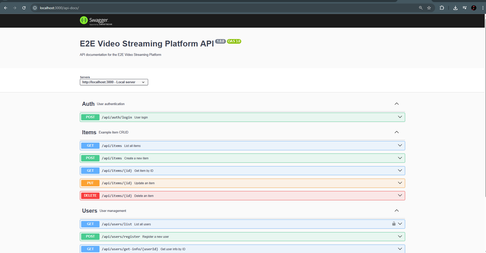

# E2E Video Streaming Platform

## Table of Contents
1. [Overview](#overview)
2. [Features](#features)
3. [Why HLS (HTTP Live Streaming)?](#why-hls-http-live-streaming)
4. [Architecture](#architecture)
5. [Project Structure](#project-structure)
6. [Getting Started](#getting-started)
7. [Screenshots](#screenshots)
8. [Future Requirements](#future-requirements)

---

## Overview
E2E Video Streaming Platform is a modern, full-stack application for uploading, sharing, and watching videos. It leverages a scalable, cloud-native backend and a beautiful, responsive React frontend. The platform is designed for creators and viewers, supporting adaptive streaming, comments, and robust AWS-powered infrastructure.

---

## Features
- User authentication (Google sign-in, email/password)
- Video upload with progress and thumbnail
- Video feed and detail pages
- User profile and "My Videos" management
- Comments on videos
- Responsive UI (MUI + Tailwind CSS)
- AWS S3 for video storage
- AWS Lambda for video processing (FFmpeg layer)
- AWS DynamoDB for metadata
- AWS SQS for event-driven processing
- GitHub Actions CI/CD for infrastructure and code
- Swagger UI for API documentation

---

## Why HLS (HTTP Live Streaming)?

### Use Cases
- Adaptive video streaming for web and mobile
- Live event broadcasting (sports, concerts, webinars)
- Video-on-demand platforms (YouTube, Netflix, etc.)
- E-learning and online courses
- Corporate video delivery and internal communications

### Importance
- HLS is the industry standard for delivering video over the internet, supported by all major browsers and devices.
- Enables smooth playback by adapting video quality to the viewer’s network conditions.
- Essential for scalable, reliable, and secure video delivery at global scale.

### Advantages
- **Adaptive Bitrate Streaming:** Automatically adjusts video quality for the best user experience.
- **Cross-Platform Support:** Works on iOS, Android, desktop browsers, smart TVs, and more.
- **Scalability:** Easily integrates with CDNs for massive audience reach.
- **Resilience:** Handles network interruptions gracefully, resuming playback when possible.
- **Security:** Supports encryption and secure key delivery.

### Learn More
- [Apple HLS Overview](https://developer.apple.com/streaming/)
- [Wowza: What is HLS?](https://www.wowza.com/blog/what-is-hls)
- [Mux: HLS Streaming Explained](https://www.mux.com/learn/hls)
- [Wikipedia: HTTP Live Streaming](https://en.wikipedia.org/wiki/HTTP_Live_Streaming)

---

## Architecture
- **Frontend:** React + Vite + MUI + Tailwind CSS
- **Backend:** Express.js, AWS SDK
- **Storage:** S3 (videos), DynamoDB (metadata)
- **Processing:** Lambda (FFmpeg), SQS (event queue)
- **CI/CD:** GitHub Actions

---

## Project Structure
```
├── backend/         # Express.js API, AWS integration, video upload logic
├── frontend/        # React app (Vite, MUI, Tailwind CSS)
│   ├── src/
│   │   ├── components/   # Navbar, VideoCard, VideoPlayer, etc.
│   │   ├── pages/        # Home, Feed, Upload, MyVideos, VideoDetail
│   │   └── ...
├── .github/workflows/    # GitHub Actions for AWS infra & deployment
└── README.md
```

---

## Getting Started
### Prerequisites
- Node.js 18+
- AWS account & credentials
- Yarn or npm

### Backend Setup
```sh
cd backend
cp .env.example .env # Fill in AWS and DB config
npm install
npm run dev
```

### Frontend Setup
```sh
cd frontend
npm install
npm run dev
```

### Worker Lambda Function

See [`worker/README.md`](worker/README.md) for details on the Lambda function that processes video files (transcoding, thumbnails, etc.) in response to S3/SQS events.

### Deployment Automation

This Lambda function is automatically built and deployed using GitHub Actions workflows defined in the `.github/workflows/` directory of the repository.

- **Workflow:** [`provision-lambda-function.yml`](../.github/workflows/provision-lambda-function.yml)
  - **Description:** This workflow packages the Lambda code, publishes the FFmpeg layer, creates or updates the Lambda function, and configures SQS triggers and IAM roles. It ensures the Lambda is always up-to-date and properly integrated with the rest of the AWS infrastructure.

For full deployment orchestration (including S3, SQS, DynamoDB, and Lambda), see [`deploy-master.yml`](../.github/workflows/deploy-master.yml).

---

## Screenshots
### Application Architecture

*A high-level overview of the platform’s architecture, showing the flow between frontend, backend, AWS services, and CI/CD pipelines.*

### Home Page

*The landing page welcomes users and highlights the platform’s core features, with options to sign in or register.*

### Login Page

*A clean and simple login dialog for user authentication, supporting Google and email sign-in.*

### Feed of Video Page

*Displays a grid of trending and recent videos from all users, allowing easy browsing and discovery.*

### Video Player Page

*A responsive video player with playback controls, showing the selected video in detail.*

### Video Detailed Play Page

*Shows the video, its description, uploader info, and related videos, providing an immersive viewing experience.*

### Video Comment

*Users can view and add comments under each video, fostering community interaction.*

### Video Upload Page

*A user-friendly form for uploading new videos, including title, description, and thumbnail selection.*

### Video Upload Success

*Confirmation screen shown after a successful video upload, with a link to view the new video.*

### Profile Page

*Displays the user’s profile information and a list of their uploaded videos for easy management.*

### Swagger page

*Swagger API documentation for all backend endpoints, supporting easy testing and integration.*

---

## Future Requirements
- Video transcoding to multiple resolutions
- User roles (admin, moderator, creator, viewer)
- Video analytics dashboard
- Live streaming support
- Subscriptions and notifications
- Social features (likes, shares, follows)
- Advanced search and filtering
- Multi-language support
- Accessibility improvements
- Mobile app (React Native or Flutter)
